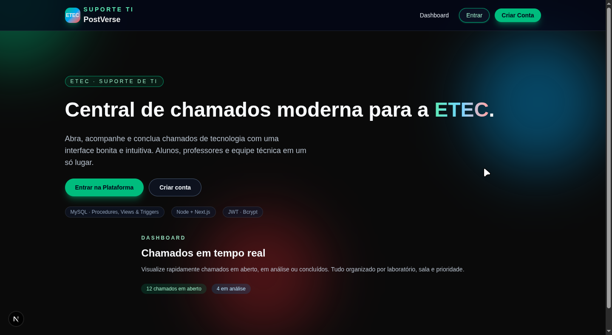
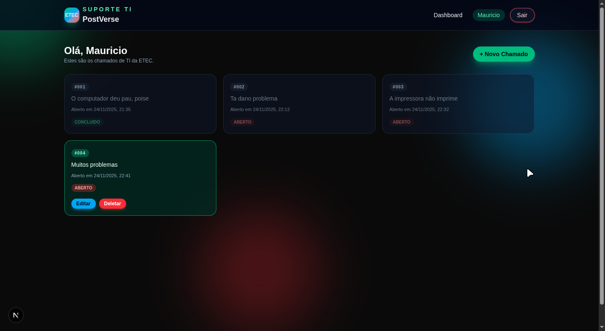
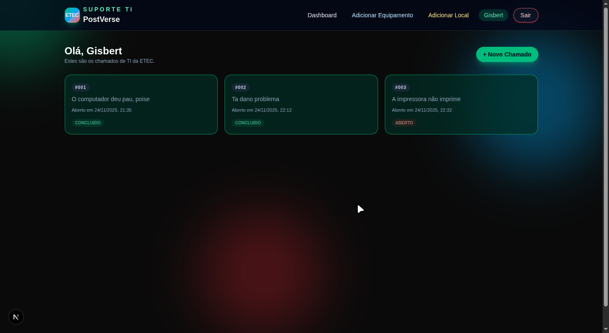
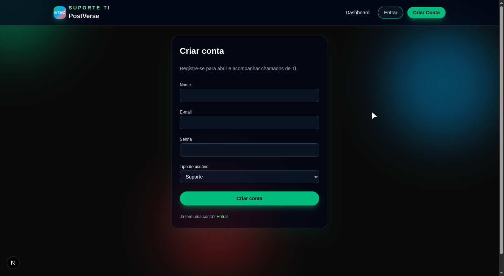

# PostVerse · Suporte TI ETEC

Central de chamados moderna para escolas ETEC. Abra, acompanhe e conclua chamados de tecnologia com uma interface bonita, intuitiva e segura. Alunos, professores e equipe técnica em um só lugar!

## Funcionalidades

- Cadastro e login de usuários (solicitante/suporte)
- Dashboard com visualização dos chamados
- Criação, edição e exclusão de chamados
- Controle de acesso: solicitante só edita/deleta seus chamados, suporte acessa todos
- Cadastro de equipamentos e locais (apenas suporte)
- Visualização de logs e histórico
- API documentada via Swagger

## Tecnologias

- MySQL (procedures, views, triggers)
- Node.js + Express (backend, JWT, Bcrypt)
- Next.js + React + Tailwind (frontend)

## Preview

### Home

### Dashboard (Solicitante)

### Dashboard (Suporte)

### Cadastro

### Novo Chamado

## Como rodar

1. Clone o repositório
2. Configure o arquivo `.env` no backend
3. Execute o script SQL para criar o banco
4. Instale dependências e rode backend e frontend

## API

Veja a documentação completa em `/api/docs` (Swagger).

---
Projeto acadêmico ETEC · PostVerse
